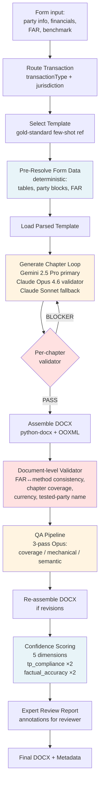

# Transfer Pricing Local File Generator

An AI-driven pipeline that generates audit-grade **US Transfer Pricing Local File** documentation — the compliance report multinationals must file to defend their intercompany pricing to the IRS under IRC §482 and Treas. Reg. §1.6662-6.

Turns a structured form payload into a fully formatted, footnoted, regulation-cited Microsoft Word document in **~2 minutes** — replacing a 40–80 hour manual drafting workflow that would otherwise run through a Big-4 transfer-pricing team.

---

> ### 🔒 Confidentiality notice
>
> This README describes the **architecture and engineering approach** of a working production system. Proprietary IP — LLM prompts, template markdown, jurisdiction-specific compliance rules, the internal style guide, and any client-specific outputs — has been deliberately withheld. Redacted regions are marked `<redacted — proprietary>` throughout. If you're evaluating this for hire or partnership, ask for a full walkthrough.

---

## Why this is hard

A US Transfer Pricing Local File isn't a form you fill out. It's a **35–60 page analytical document** with:

- Multi-chapter narrative structure (Executive Summary → US TP Regulations → Statement of Facts → Industry Overview → Functional Analysis → Method Selection → Conclusion → Scope of Use)
- Regulatory citations (IRC §482, Treas. Reg. §1.482-1 through §1.482-9, Reg. §1.6662-6) that must be **exact** and match the discussion
- Financial tables where **any rounding language ("approximately", "around") is grounds for audit rejection**
- FAR (Functions / Assets / Risks) analysis that must be **internally consistent** with the transfer pricing method selected
- Comparable-companies benchmarking with interquartile ranges, medians, and weighted-average logic
- Real Word footnotes (not endnotes, not superscripts) with regulation citations
- A conclusion that must be **defensible under a tax audit** — no hedging, no fabrication, no first-person voice

The hard part isn't generating text. It's generating text that **does not hallucinate a regulation, invent a comparable company, or drift off the form data** — and that a taxpayer will actually file with the IRS.

---

## Architecture



**Legend.** Blue = deterministic. Yellow = LLM. Red = deterministic guardrail. The whole pipeline is a custom async state machine — **not LangGraph** — to keep control-flow debuggable and to allow arbitrary revision cycles between the validator, the LLM, and the QA pass.

---

## Model orchestration

The pipeline uses **three models** for three distinct roles. This is deliberate — no single model is best at all three.

| Role | Model | Temperature | Max tokens | Why |
|---|---|---|---|---|
| Chapter generation (primary) | Gemini 2.5 Pro | 0.3 | 4,000 / chapter | Long context, strong at structured legal-financial prose |
| Chapter generation (fallback) | Claude Sonnet 4.5 | 0.3 | 4,000 / chapter | Kicks in on Gemini rate-limit or refusal |
| Semantic validation & QA | Claude Opus 4.6 | 0.1 | 2,000 | Higher fidelity for consistency + compliance checks |

**Rolling context strategy.** When generating chapter *N*, the prompt includes:
- Full text of chapters 1 through N−1 (when N ≤ 3)
- **Summarized** older chapters + full text of the last 2 (when N > 3)

The summarization is done by the same primary model using a dedicated `CONTEXT_SUMMARY_PROMPT` (`<redacted — proprietary>`) — this keeps the context window bounded while preserving cross-chapter references (e.g., "as detailed in Chapter 4").

**Per-chapter validator** runs after every LLM call. On a BLOCKER finding, one revision is attempted; a second failure escalates to the expert-review report rather than silently retrying.

---

## Deterministic pre-resolution

The single biggest risk in this domain is the LLM **rewording financial numbers or fabricating regulation subsections**. Both are grounds for IRS audit rejection.

Instead of asking the LLM to render financial tables from raw numbers, the pipeline **deterministically pre-resolves** all quantitative content — the LLM only inserts the pre-rendered strings as opaque tokens:

```typescript
// interfaces/pre-resolved-context.interface.ts
interface LocalFilePreResolvedContext {
  // Full legal-entity identification blocks
  testedPartyBlock: string;
  relatedPartyBlock: string;

  // Financial tables (markdown pipe-table format,
  // pre-formatted with comma-separated thousands,
  // 2-decimal percentages, parenthesized negatives)
  transactionValueTable: string;
  segmentedPnlTable: string;

  // FAR side-by-side (Functions / Assets / Risks)
  farComparisonTable: string;

  // Benchmark results block (PLI, IQR rows, comparable count)
  benchmarkResultsBlock: string;

  // Formatted primitives
  fiscalYearFormatted: string;
  currencyFull: string;
  pricingMethodName: string;
}
```

The LLM never sees raw numbers — only pre-rendered strings — so it **cannot round, reformat, or drift**.

---

## Deterministic validation layer

Two layers of **non-LLM** validators run before the QA pass ever sees the document.

### Per-chapter (~8 checks)
- Heading level matches template
- Length within bounds (`min 200 chars / max 30,000 chars`)
- No unfilled `[TO BE PROVIDED]` placeholders
- No rounding language preceding a numeric (`approximately`, `around`, `circa`, `roughly`)
- No first-person pronouns (`we `, `our `, `us `)
- No subjective language (`believe`, `feel`, `think`)
- Cross-chapter references resolvable
- Required fields (from `SectionDefinition.requirements`) are present

### Document-level (~8 checks)
- All chapters present and correctly numbered
- **FAR characterization ↔ pricing method consistency**
  - LRD → TNMM / Resale Price
  - Principal / entrepreneur → Profit Split
  - Service provider → Cost Plus / TNMM
- Financial figures in the benchmarking chapter match transaction values in the Statement of Facts
- Single currency throughout
- Tested-party name appears in ≥50% of chapters
- IRC §482 / Treas. Reg. citations present in method-selection chapter
- No duplicate chapters
- Signature / conclusion block present

A failure here **blocks progression** to the QA pass — cheaper to catch structural bugs mechanically than to burn Opus tokens on them.

---

## LLM QA — three passes, one panel

After the deterministic validators pass, the document goes through three orthogonal QA reviews, each with a specialized system prompt (`<redacted — proprietary>`):

| Pass | Looks for |
|---|---|
| **Coverage** | Missing sections, unaddressed required fields, insufficient depth on FAR / method selection / benchmark rationale |
| **Mechanical** | Regulation-citation errors, financial-figure drift, cross-reference breakage, defined-term consistency |
| **Semantic** | Internal logical consistency, FAR ↔ conclusion coherence, audit-readiness of the final arm's length position |

Each pass emits structured findings (severity: BLOCKER / WARNING / SUGGESTION). BLOCKER findings trigger revision loops; WARNINGs surface in the expert-review report.

---

## Confidence scoring

Five-dimension weighted average, output alongside the final DOCX:

```typescript
type ConfidenceDimension =
  | 'documentation_completeness'   // weight 1
  | 'tp_compliance'                // weight 2
  | 'factual_accuracy'             // weight 2
  | 'internal_consistency'         // weight 1
  | 'audit_readiness';             // weight 1

interface ConfidenceScore {
  dimensions: Record<ConfidenceDimension, number>; // 0–100
  weightedAverage: number;
  reasoning: string; // per-dimension justification
}
```

`tp_compliance` and `factual_accuracy` are weighted **2×** because they're the two dimensions with real audit consequences.

---

## Custom OOXML pipeline for Word output

The DOCX is generated by a **custom python-docx + pandoc AST + post-save OOXML injection** pipeline, not by pandoc's built-in DOCX writer.

Why:

- **Pandoc's DOCX output produces an empty table-of-contents page** because the TOC field is unresolved on open — Word doesn't know to refresh it.
- **Pandoc doesn't render placeholder highlights** (yellow shading + bold red text for `[TO BE PROVIDED]` values that a reviewer needs to fill in).
- **Pandoc's footnote handling generates endnotes, not real Word footnotes** — a compliance issue for TP filings.
- **Pandoc's DOCX cover page collapses to a metadata block** rather than a formatted cover.

The custom pipeline:

1. **Pandoc** `content.md` → JSON AST (uses `+pipe_tables +bracketed_spans +raw_attribute +yaml_metadata_block +footnotes`)
2. **AST walk** emits `python-docx` calls with full formatting control
3. **Custom character styles** injected via direct OOXML: `Placeholder` (yellow highlight + bold red), `RegCite` (navy non-breaking regulation citation)
4. **TOC field** built with proper `w:fldChar begin/separate/end` markers so Word auto-refreshes on document open (`updateFields` settings flag)
5. **Page-number fields** in footer, also via `fldChar` markers (not the deprecated `w:fldSimple` form)
6. **Footnotes** — post-save step: python-docx has no footnote support, so the pipeline injects `word/footnotes.xml` into the docx package as a post-save zip manipulation, plus registers the part in `[Content_Types].xml` and `word/_rels/document.xml.rels`
7. **Colour palette** derived from the Indian Bio-Rad transfer pricing sample: navy `#000080` for Heading 1, maroon `#800000` for Heading 2, teal `#008080` for Heading 3

The result opens cleanly in Word / Google Docs / LibreOffice, refreshes its TOC on open, renders footnotes at the bottom of the correct page, and passes structural DOCX validators.

---

## Jurisdiction extensibility

The system is designed from day one to support additional jurisdictions. The template registry is keyed by `(transactionType, jurisdiction)`:

```typescript
export type LocalFileTransactionType = 'SERVICES' | 'DISTRIBUTION';
export type LocalFileJurisdiction = 'US' | 'INDIA' /* | 'UK' | 'SG' | ... */;

// templates/index.ts
type TemplateKey = `${LocalFileTransactionType}_${LocalFileJurisdiction}`;
type TemplateMap = Record<TemplateKey, ParsedLocalFileTemplate>;

const TEMPLATE_MAP: TemplateMap = {
  US_SERVICES: /* <redacted — proprietary template body> */,
  US_DISTRIBUTION: /* <redacted — proprietary template body> */,
  INDIA_SERVICES: /* <redacted — smoke-test template> */,
  // adding a jurisdiction = drop in one new ParsedLocalFileTemplate object
};
```

Each `ParsedLocalFileTemplate` bundles the gold-standard chapter structure, required fields per chapter, regulation citations, and formatting hints — everything the generator needs to swap the jurisdictional rules without touching pipeline code.

Ships US v1. India is wired in as a structural smoke test to validate the abstraction.

---

## Module layout

```
src/features/local-file-generator/
├── config/
│   ├── llm-config.ts              # Model config, temperatures, token budgets
│   └── docx-styles.ts             # Colour palette, fonts, style constants
├── dto/
│   ├── generate-local-file.dto.ts
│   └── local-file-output.dto.ts
├── graph/
│   ├── local-file-graph.ts        # 12-step async state machine
│   ├── graph-state-factory.ts
│   └── nodes/
│       ├── route-transaction.ts
│       ├── select-template.ts
│       ├── generate-chapter.ts    # Gemini + Claude fallback + validator
│       ├── assemble-docx.ts       # LF-specific DOCX compiler
│       ├── validate-document.ts
│       ├── qa-validation.ts       # 3-pass QA panel
│       ├── score-confidence.ts
│       └── output-metadata.ts
├── interfaces/
│   ├── form-input.interface.ts
│   ├── graph-state.interface.ts
│   ├── parsed-template.interface.ts
│   └── pre-resolved-context.interface.ts
├── prompts/                       # <redacted — proprietary>
├── services/
│   ├── placeholder-resolver.service.ts
│   ├── template-parser.service.ts
│   ├── chapter-validator.service.ts
│   ├── full-document-validator.service.ts
│   ├── form-data-checker.service.ts
│   └── expert-review-report.service.ts
├── templates/                     # <redacted — proprietary>
├── local-file-generator.module.ts
├── local-file-generator.controller.ts
├── local-file-generator.service.ts
└── local-file-generator.processor.ts   # Bull queue worker
```

Plus a standalone Python DOCX assembler in a separate service that handles the OOXML-level formatting.

---

## Interface highlights

The core form-input interface (public — no IP):

```typescript
export interface LocalFileFormInput {
  // Parties
  testedParty: LocalFilePartyInfo;
  relatedParty: LocalFilePartyInfo;
  testedPartyDesignation: 'TESTED_PARTY' | 'RELATED_PARTY';

  // Transaction
  transactionType: LocalFileTransactionType;
  transactionDescription: string;
  transactionValueCurrentYear: number;
  transactionValuePriorYears?: { fiscalYear: string; value: number }[];

  // Functional analysis (FAR)
  testedPartyFunctions: string[];
  testedPartyAssets: string[];
  testedPartyRisks: string[];
  relatedPartyFunctions: string[];
  relatedPartyAssets: string[];
  relatedPartyRisks: string[];

  // Industry & business context
  industryDescription: string;
  businessOverview: string;
  groupStructureDescription: string;

  // Transfer pricing method
  pricingMethod: 'CUP' | 'COST_PLUS' | 'TNMM' | 'RESALE_PRICE' | 'PROFIT_SPLIT';
  pricingMethodRationale?: string;
  pricingDetails: string;
  armLengthRangeDescription?: string;

  // Benchmarking (optional — missing values render as [TO BE PROVIDED])
  benchmarkResults?: BenchmarkResult;

  // Financials — multi-year
  financialData: FinancialDataYear[];
  currency: string;

  // Governing framework
  fiscalYearUnderReview: string;
  governingRegulations?: string;
  jurisdiction: LocalFileJurisdiction;
}
```

---

## Runtime

- **NestJS** module — mounts under `/local-file-generator`
- **Endpoints**: `POST /generate`, `GET /status/:id`, `GET /chapters/:id`
- **Auth**: `MAIN_APP_ADMIN | COMMENDA_INTERNAL_USER` roles
- **Job queue**: Bull-backed async worker (generation takes 90–180s, so it's queued)
- **Persistence**: Prisma-backed `TPDocumentRecord` from day one — status transitions `PENDING → IN_PROGRESS → SUCCESS | FAILED`
- **Storage**: S3 for the final DOCX, returned to the caller as a signed URL

---

## Tech stack

| Layer | Choice |
|---|---|
| API / orchestration | TypeScript + NestJS |
| Queue | Bull (Redis-backed) |
| Persistence | PostgreSQL via Prisma |
| Object storage | AWS S3 |
| LLM providers | Google (Gemini 2.5 Pro), Anthropic (Claude Opus 4.6 + Sonnet 4.5) |
| Markdown → JSON AST | pandoc |
| DOCX generation | python-docx + custom OOXML injection |
| PDF (secondary path) | WeasyPrint (HTML → PDF) |
| Testing | Jest, ~140 tests across per-chapter validators, document-level validators, DOCX compiler, template consistency, prompt generation |

---

## What's **not** in this repo (intentionally redacted)

- All LLM prompts (chapter generation, QA passes, confidence scoring, context summarization)
- Template markdown bodies for each `(transactionType, jurisdiction)` combination
- The internal style guide (naming conventions, tone rules, defined-term policy, US-vs-Indian sample-derived formatting rules)
- Client-generated example DOCX outputs
- Regulation-citation databases and jurisdictional compliance rules
- Confidence-scoring dimension definitions

If you're evaluating this for hire or partnership and want a live demo or a walkthrough of the redacted internals, reach out.

---

## Engineering interestingness (for reviewers)

If you're skimming this to evaluate engineering depth, the non-obvious challenges are:

1. **Dual-model LLM orchestration** — Gemini for generation, Claude Opus for validation, Claude Sonnet as fallback — with per-chapter graceful degradation, not global failover
2. **Deterministic pre-resolution of quantitative content** — the LLM never sees raw numbers, only pre-rendered strings — eliminates a whole class of hallucination risk
3. **Two-layer validation** — deterministic checks run before the LLM QA panel, catching cheap structural bugs before burning Opus tokens
4. **Rolling-context strategy** — full previous-chapter text for the first three chapters, summarized-plus-last-two after that
5. **Custom async state machine** instead of LangGraph — chosen for debuggability, explicit control flow, and arbitrary revision cycles
6. **OOXML manipulation** for real Word footnotes (post-save zip injection), TOC auto-refresh (`fldChar begin/separate/end`), and character styles (yellow-highlight placeholders + navy regulation citations) — none of which pandoc's built-in DOCX writer can produce
7. **Jurisdiction extensibility** via a `(transactionType, jurisdiction)` template registry — adding a new country is a template-drop-in, not a code change
8. **~140 tests** covering the deterministic layers, plus integration tests for the LLM pipeline with mocked responses

---

## License

Proprietary. This README is a public-facing description of the architecture; the code is not open source.
